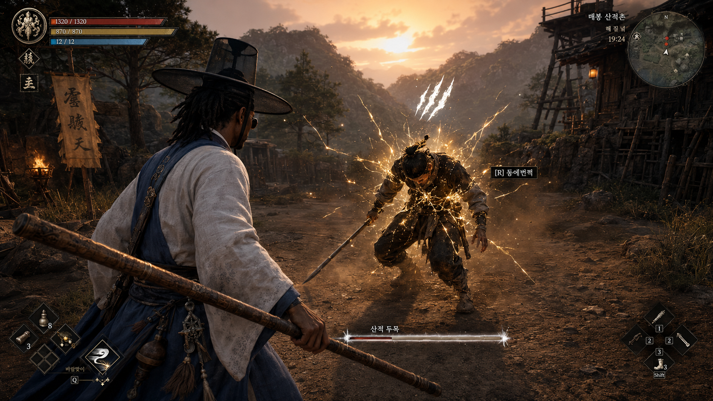
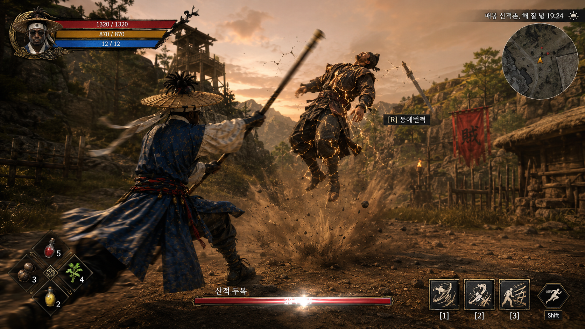
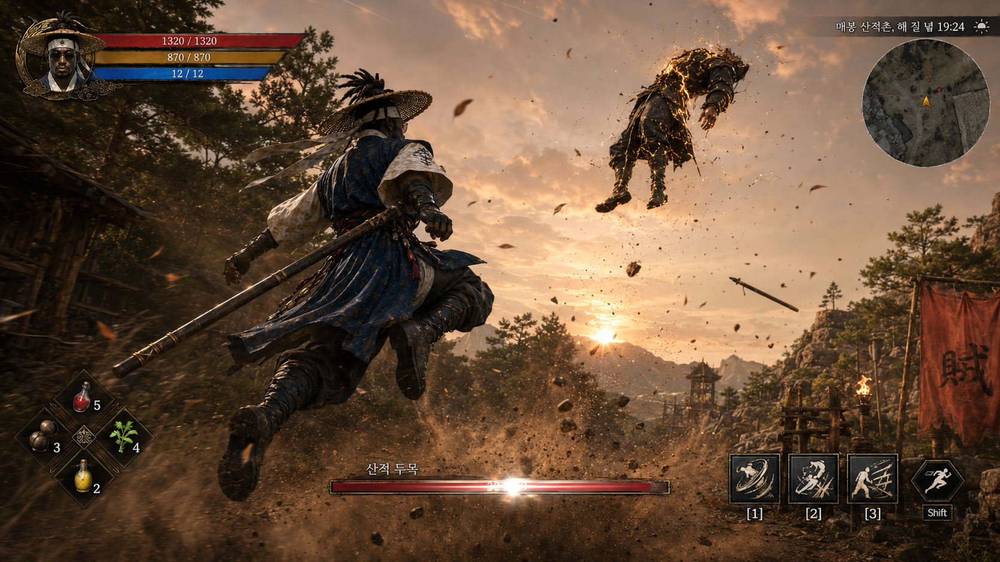
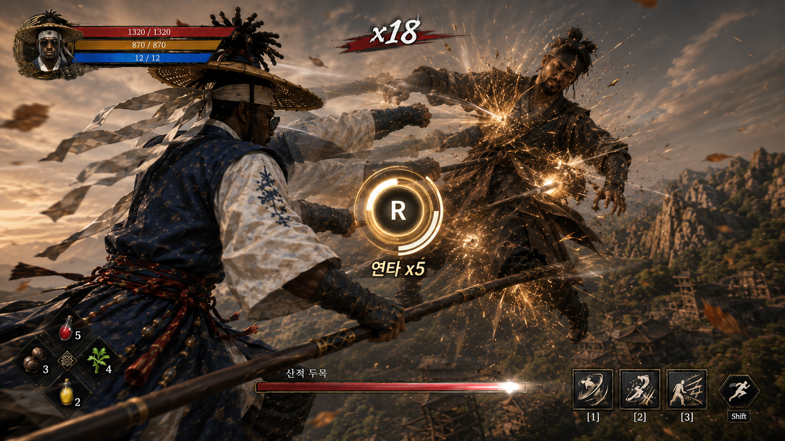
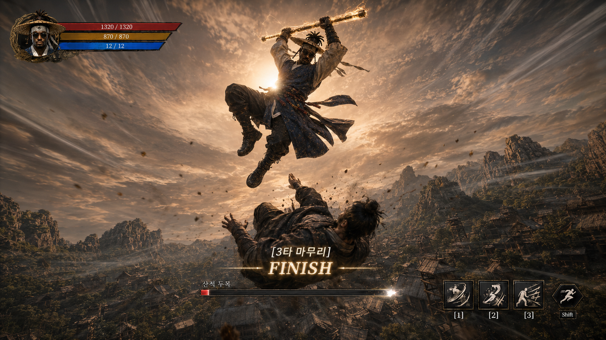
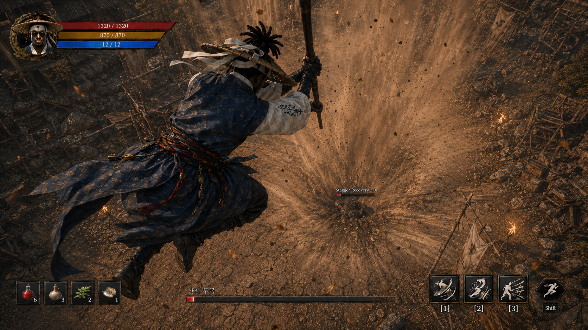

# 🎯 공중QTE 기획

> 영역 책임: 승환 / 작성 중
> 시그니처 시스템: **동에 번쩍 서에 번쩍**

---

## ✅ 기본 사양

| 항목 | 결정값 | 비고 |
|------|--------|------|
| 입력 키 | F키 | 리매핑 가능 |
| 프롬프트 방식 | 화면 자동 표시 (조건 충족 시) | WBP_QTE 위젯 |
| 슬로우모 배율 | 0.2x (진입 시) | 입력 윈도우 체감 보정 |
| 입력 윈도우 | **0.8초** | 표준 |
| 공중 체공 시간 | **3초** | |
| 실패 패널티 | **피격** | 적이 길동 때림 |
| GAS 어빌리티 | `GA_AirCombo` | F8 Epic 산하 |

---

## 🎬 발동 흐름 — 6단계 시퀀스

> 트리거 충족 시 F 누름 → 아래 6단계 자동 진행. 평균 3초.

### 1단계 — 페이탈 가능 표시
> 

적 Posture 만충 또는 점프 공격 직전 → 적 몸에 **황금 균열 이펙트** + 머리 위 **발톱 표식** + 체력바 흰색 깜빡 + `[F] 동에번쩍` 프롬프트 표시.

### 2단계 — 강공 띄움 (R 자동)
> 

플레이어가 R 누르면 길동이 자동으로 강한 공격을 발사해 적을 **공중에 띄움**. 적 무기 손에서 떨어지며 비행.

### 3단계 — 점프 추격
> 

길동이 봉을 앞세워 적을 향해 **솟구침** (DMC5 Stinger식 돌격). 산바람·갈잎 흩날림. 슬로우모 진입.

### 4단계 — 공중 연타 (Phase 1)
> 

공중에서 **연타** (따다다다). 길동 주먹·봉 다발 공격. 화면 중앙 `[R] 연타 x5` QTE 프롬프트 + 콤보 카운터 `x18`. 매 입력마다 적 흙먼지 폭발.

### 5단계 — 3타 마무리 정점 (Phase 2)
> 

봉 머리 위로 들어올린 **apex 프레임**. 임팩트 직전 정지. 화면 중앙 `[3타 마무리] FINISH` 표시. 슬로우모 + 카메라 셰이크.

### 6단계 — 지면 내리꽂기
> 

길동은 공중 유지, 봉/주먹으로 **아래 방향 강타** → 적이 멀리 아래 지면에 박힘. 작은 크레이터 + 흙먼지 폭발. 적 머리 위 `Stagger Recovery 2.0s` 카운트다운.

---

## 🎯 발동 조건 (트리거)

| # | 트리거 | 대상 | 비고 |
|---|--------|------|------|
| **T1** | Posture(방어막) 만충 → 0 | 보스·엘리트만 | P의 거짓 페이탈 상태 유사 |
| **T2** | 적 점프 공격 직전 | 점프 공격 가능 적 (호위 무사·보스) | 패링 변형 |

> ⚠️ 트리거 발동 시 적에게 "동에번쩍 가능" 시각 이펙트 표시 → 플레이어 인지 → F 누름

### T1 vs T2 시퀀스 차이
- **T1 (Posture)**: 1 → **2 (강공 띄움)** → 3 → 4 → 5 → 6 (6단계 풀 시퀀스)
- **T2 (점프 공격)**: 1 → 3 → 4 → 5 → 6 (2단계 생략. 적이 이미 공중에 떠 있어서)

---

## ⚙ 시스템 디테일

### R 자동 띄움 — 확정
- 페이탈 가능 이펙트 표시된 적 있으면 **F 누름 → 자동 띄움 + QTE 진입**
- F키는 동에번쩍 전용
- P의 거짓식 LMB 발동 안은 폐기 (F키 단일 입력으로 통일)

### 다중 적 대응
- 한 번에 **1명만** 가능
- 여러 적 동시 조건 충족 시 → **가장 가까운 1명**

### QTE 입력 패턴 — 적별 차등 ✅ 확정
적의 격에 맞춰 패턴 풀이 다름. 잡몹은 피로감 방지 위해 단발 고정. 엘리트·보스는 랜덤으로 매번 다르게.

| 적 등급 | 입력 패턴 풀 | 비고 |
|---------|-------------|------|
| **잡몹** | **단발 (R 1회) 고정** | 잡몹전 피로감 방지 — 매번 같음 |
| **엘리트** | 연타 / 방향 / 혼합 중 **랜덤** | 호위 무사 등 |
| **보스** | 연타 / 방향 / 혼합 중 **랜덤** | 보스 페이즈별 |

**패턴 타입**:
- **단발** — R 1회
- **연타** — R 연타 (3~5회)
- **방향 입력** — F + W·A·S·D 방향
- **혼합** — 단발 → 연타 → 방향 조합

### 연타 시퀀스 구조 — "연타 + 마무리"

```
[QTE 성공 → 공중 진입]
   ↓
Phase 1: 연타 페이즈 (~2초)
   따다다다. R 연타 또는 자동
   시각적 만족감 위주
   ↓
Phase 2: 마무리 페이즈 (~1초)
   3타 짧고 굵게 내려찍기
   임팩트 + 슬로우모 + 카메라 셰이크
   ↓
[지면 내리꽂기 → 적 1~2초 다운]
```

> 💡 비유: DMC 콤보 마무리·갓 오브 워 처형의 구조

### QTE 종료 후 상태

| 캐릭터 | 상태 |
|--------|------|
| 길동 | 공중 → 플레이어 조작 복귀 → 자유 낙하 → 바닥 착지 |
| 적 | 땅에 박힘 → 1~2초 다운 → 자세 잡으며 일어남 |

다운 1~2초 동안 **추가 공격 가능** ✅ (콤보 연계 가능)

> 💡 QTE 자체가 컷신 역할 — 종료 후 별도 처형 컷씬 없이 **바로 일반 전투 복귀**. ✅ 확정

---

## ✅ 주요 결정 완료

핵심 시스템 결정 100% 확정. 잔여는 M3 폴리시 단계에서 튜닝 (수치 미세 조정·VFX 다듬기).
