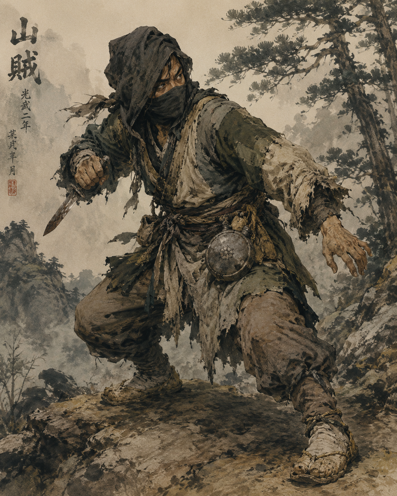
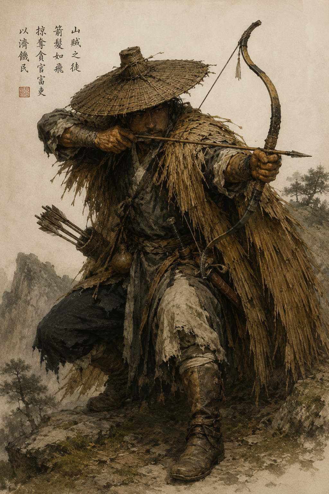
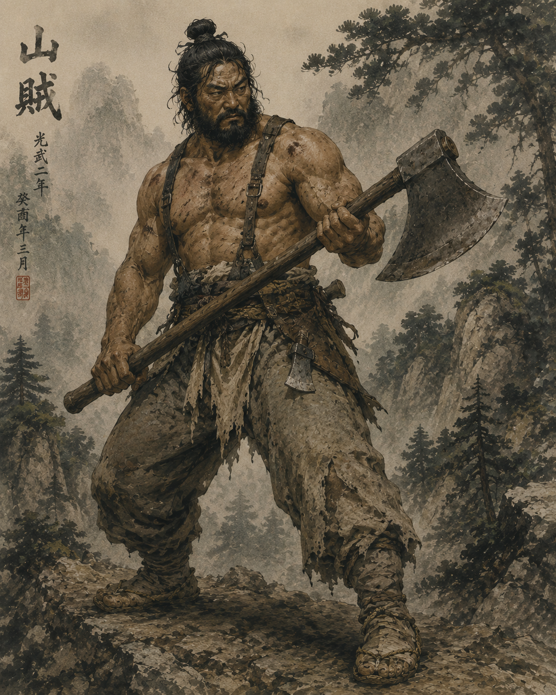
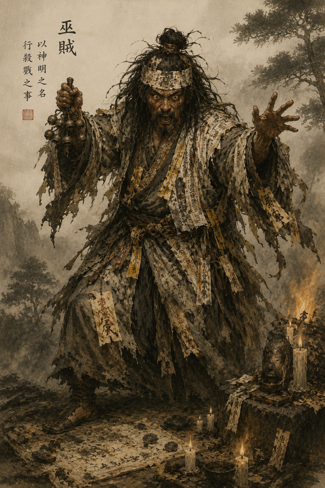
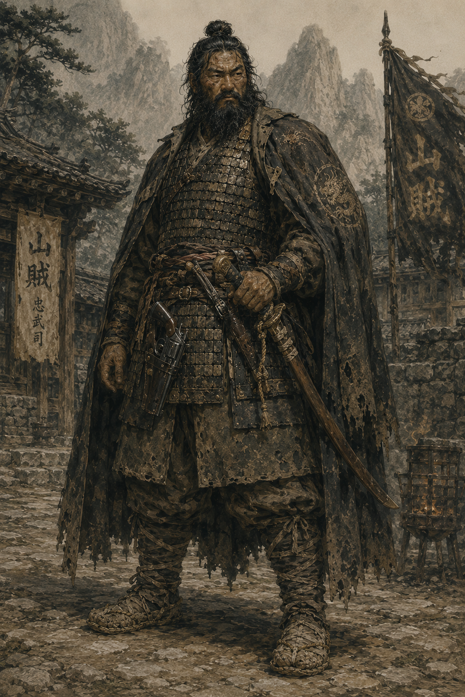
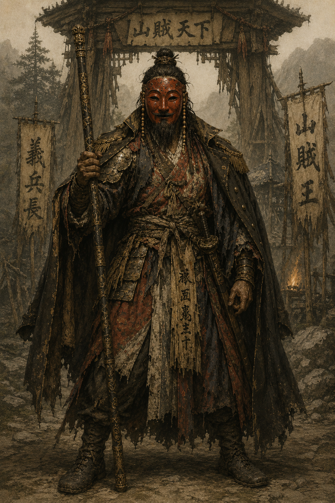
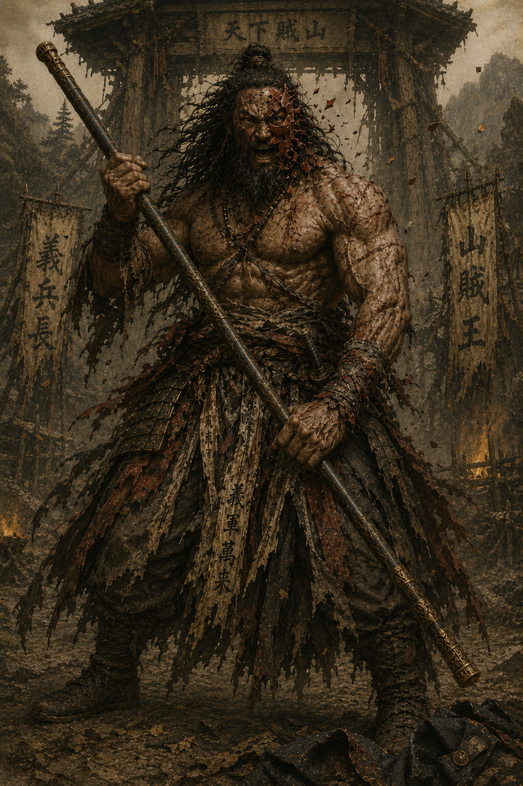

---
title: ProjectKD 적 컨셉 정리
tags:
  - ProjectKD
  - enemy-design
  - concept
created: 2026-05-14
status: 고필규_초안
related:
  - - 팀원이짠 Epic_Task
---

# 적 컨셉 정리

## 🎭 컨셉 — 의병 잔당 

- **시대**: 근대 초기 — 가상국 침탈기 톤 (1900~1920년대 미감) — **암시 정도**, 명시 X (정치적 부담 0)
- **서사**: 본래 의병이었으나 시대에 밀려 산골 도적으로 전락한 무리
- **미학**: 누더기 한복 + 노획한 근대 군용품의 잡스러운 혼재 — 시대 미스매치가 곧 비극 + 병맛
- **톤**: 황토·이끼·먹·솔잎 색조. 핏빛·네온 없음. 흙먼지·낙엽·산바람 VFX
- **이중성**: 진지 = 의병의 추락. 병맛 = 노획 회중시계 차고 한복 입은 도적
- **민속 판타지 한 스푼**: 무당 주술·부적·도깨비불 VFX. 보스 P3에서 본격 발현. *과용 금지 — 게임은 현실 산골 도적단이고 판타지는 양념*
- **병맛 톤 정책**: 시각·환경·대사 디테일에만 한정 (예: 가마솥에 군용 통조림, 부적에 이국 문자 신문 조각). 잡몹 패턴은 진지 유지 — 톤 충돌 방지

## 🎭 가면 룰 (디자인 가이드)

- **잡몹**: 가면 X (얼굴 노출 or 두건)
- **엘리트**: 가면 X (수염·투구 등 다른 정체 표현)
- **보스**: **각자 다른 한국 전통 탈** ⭐ — 보스의 시각 식별 시그널

→ 추후 보스 추가 시 새 가면만 정하면 됨. 후보 풀: **양반탈(위엄)·백정탈(잔혹)·사자탈(거대)·노장탈(노쇠 광인)·처용탈(신비)**. 현재 데모 보스 = **각시탈** (붉은 각시, 의병 상징).

## ⚔ 적 구성

| 적 | 등급 | 학습 메커니즘 (Primary + 도술 거울) | 색상 | 프리셋 |
|----|------|-----------------------------------|------|--------|
| 검사 도적 | 잡몹 | 패링 (기본 — 소수 정면, 평타 무색 큐없음) | 무색 | A |
| 단검 도적 | 잡몹 | 회피 (다수 투척+기습, 정승 스턴 거울) | 노랑 | A |
| 활잡이 도적 | 잡몹 | 거리 두기 (kiting/standoff, 풍보 거울) | 색X (BT행동) | A |
| 도끼 도적 | **엘리트** | 회피+치명 조합 시험관 (패링·화부술 거울) | 노랑+빨강 | B |
| 무당 도적 | 잡몹 | 봉으로 캐스팅 끊기 (화부술 미니어처) | 색X (거리=BT행동) | A |
| 호위 무사 | 엘리트 | 분신술(엘리트 전용) + 동에번쩍 (풍보 거울) | 노랑+빨강 등 | C |
| 도적 두목 (각시탈) | 보스 | 광폭화 응전 + P3 이중 트리거 | 페이즈별 | D |

> [2026-06-01 M2 재정의] **검사**(기존 melee 잡몹, `UGA_EnemyBasicAttack` 무변경, 장검 스왑) = 패링 튜터. **단검**(신규) = 단검 투척+기습 회피 튜터. **활**(신규) = 거리 kiting. **도끼** = 잡몹→**엘리트 승격**(M2 엘리트 1종). 호위 무사·보스는 M3+. 색 = C-3 신규 규약(무색=패링/노랑=회피/빨강=치명, 파=폐지).

---

## 1. 단검 도적 (잡몹)

**컨셉**: 마른 체구의 산골 졸개. 누더기 두건·헝겊신·흙때 묻은 얼굴. 다수로 몰려옴. 허리춤에 노획한 이국 군용 수통이 매달려 있음 (시대 미스매치 디테일).

**이미지 프롬프트**:
> Korean mountain bandit lowlife from late Joseon to early modern era, ragged hood covering half face, dirty hemp shoes, wiry malnourished build, ragged traditional hanbok with patches, holding a short rusty dagger, wearing a scavenged foreign military canteen at waist as trophy, earthy ochre and moss and ink and pine color palette, no neon no blood, character concept art, full body action stance, hand-painted illustration

**패턴 & 이유** [2026-06-01 M2 — 회피 튜터(노랑), melee 횡베기 → **단검 투척+기습**]:
- **역할**: 회피(Shift) 강제 학습용 = **회피 튜터 (🟡노랑, 단색)**. melee 정면은 검사 도적이 담당 → 단검은 **단검 투척(projectile) + 기습** 스커미셔로 분화(anim 사정 장검 스왑의 짝).
- **1공격**: 단검 투척 (짧은 윈드업 → 직선 투사체, 노랑 전조). 근접 폴백 시 빠른 찌르기(BP child가 Basic GA 겸비, C++ 추가 0).
- **이유**: 다수로 몰려와 사방에서 투척 → 회피 슬립 강제. 다중 타겟·락온 사이클링 + 정승 스턴(3키, 다수 컨트롤) 거울.
- **구현**: `UGA_EnemyRangedAttack` + `AKDProjectile`(메시=단검). 활도적과 GA/발사체 공용 — 차이는 BP(투척물·속도·기습 BT). 태그 `Ability.Enemy.Grunt.Attack.Ranged`(활과 공유).

---

## 2. 활잡이 도적 (잡몹)

**컨셉**: 도롱이·삿갓 차림의 원거리 견제수. 도롱이 안에 누더기 한복. 발에는 노획한 군용 가죽 부츠 — 도롱이 아래로 살짝 보임.

**이미지 프롬프트**:
> Korean mountain archer bandit from late Joseon to early modern era, traditional straw rain cape (dorongi), wide straw hat (satgat), traditional Korean horn bow, scavenged foreign military leather boots peeking under rain cape, ragged hanbok beneath, crouching aim pose, earthy ochre and moss and ink and pine palette, no neon, character concept art, full body, hand-painted illustration

**패턴 & 이유** [2026-06-01 M2 — 거리 두기 튜터, 색이 아닌 **BT 행동(kiting/standoff)**으로 거리 전달]:
- **역할**: 거리 두기 학습 = **kiting/standoff** (구 "파=거리" 색 폐지 → 색X). 플레이어 접근 시 반대방향으로 후퇴해 사거리 유지 → 풍보(2키)로 즉접근 강제. 풍보 학습의 1차 거울.
- **1공격**: 차징 사격 (1.5초 차징 → 직선 화살). 차지샷은 고데미지 → 🔴**빨강 전조(치명)**. 평타 화살은 무색.
- **이유**: standoff 유지로 "거리를 못 좁히면 일방적으로 맞는다"는 압박 → 접근 도술(풍보) 동기 부여. 다수 화살 대응으로 봉 특수공격 학습도 거울.
- **구현**: `UGA_EnemyRangedAttack` + `AKDProjectile`(메시=화살, 단검도적과 공용). standoff = **kiting BTTask**(플레이어 반대방향 × DesiredRange → MoveTo). 단검(기습 접근)과 활(standoff 후퇴)을 가르는 load-bearing은 BT 포지셔닝.
- **환경 상호작용**: 짚단·풀숲에 불화살 사격 → 화염 지대 생성 (이동 차단 + 무당의 단발 부적 학습 예고)

---

## 3. 도끼 도적 (엘리트) ⭐ [2026-06-01 잡몹→엘리트 승격 — M2 엘리트 1종]

**컨셉**: 거구·맨상투·상의 탈의. 가슴에 노획한 군용 가죽 견대(suspender)를 두름. 손에는 산림용 도끼, 허리엔 자그마한 군용 야전 도끼가 추가로 매달려 있음.

**이미지 프롬프트**:
> Korean mountain bandit hulking brute from late Joseon to early modern era, traditional topknot hair (sangtu), bare scarred chest, scavenged foreign leather military suspenders straps over torso, dirty hanbok trousers, wielding a massive two-handed lumberjack axe with a small battered military field hatchet at belt, intimidating heavy stance, earthy ochre and moss and ink and pine tones, no neon, character concept art, full body, hand-painted illustration

**패턴 & 이유** [2026-06-01 M2 — 잡몹 패링 튜터 → **엘리트 회피+치명 조합 시험관**. 패링 튜터는 검사 도적이 인수]:
- **역할**: **조합 시험관 (🟡노랑 + 🔴빨강)**. 잡몹=1마리 1레슨, 엘리트=조합. 느린 큰 모션 + 한 방이 강함.
- **공격 1 — Unblockable 강공**: 긴 윈드업(2초) → 🟡**노란 전조 = 회피하라**(패링 불가). 회피 슬립으로만 통과. *(구 "노=패링만 통과" 규약 폐지 — Unblockable은 새 규약상 노랑=회피)*
- **공격 2 — 치명 강타**: 고데미지 일격 → 🔴**빨강 전조 = 치명타**(위험도 축). 맞으면 크게 아픔.
- **이유**: 회피(노랑)와 치명 경계(빨강)를 **동시에** 시험. 두 색이 겹치지 않아 엘리트가 둘 다 줘도 안 헷갈림. 높은 MaxPoise = 경직 저항(F10, 연타 스태거 루프 차단).
- **구현 (신규 C++ 없음 — YAGNI)**: `UGA_EnemyBasicAttack` BP child(`TelegraphCueTag` = 노랑/빨강 GC, AttackPower↑, 도끼 메시/소켓 `Axe_*`, 긴 윈드업 몽타주). 차징=슈퍼아머/홀드 아님. spec §3-2.
- **환경 상호작용**: 통나무·기둥·목조 구조물 베어 진로 차단. **봉 공격 자동 트리거** — 별도 입력 없이 봉이 통나무·대용폭탄에 닿으면 파괴/점화로 길 뚫기

---

## 4. 무당 도적 (잡몹)

**컨셉**: 광기 어린 산골 무당. 부적 덕지덕지 붙은 도복, 손에 요령(방울). 부적 일부에 **이국 문자 신문지 조각**이 섞여 있음 (시대 미스매치 + 광기 표현).

**이미지 프롬프트**:
> Korean shaman bandit from late Joseon to early modern era, deranged expression with wild eyes, paper talismans pinned all over loose dirty hanbok-style robe with some talismans showing fragments of foreign-language newspaper ink, holding traditional shaman bells (yoryeong), wild unkempt hair, performing a casting ritual pose, earthy ochre and moss and ink and pine palette with subtle mystical fire glow, character concept art, full body, hand-painted illustration

**패턴 & 이유**:
- **1공격**: 단발 부적 투척 (1.2초 캐스팅, 제자리 고정 → 직선 투사체 화염, 파 신호) ⚠ **광역에서 다운그레이드** — 잡몹 ≠ 보스급. 광역은 보스 P2/P3 전유.
- **이유**: 봉 공격으로 캐스팅 끊기 학습. 길동 측 화부술의 미니어처(원형)로 본편 부적 시스템 떡밥. 거리 좁히기는 풍보(2키)로.
- **환경 상호작용**: 시야 차단 부적 (보스 P2 광역 강공 예고편) + 사망 시 부적이 1.5초간 흩날리며 잔여 화염장. **민속 판타지 시그니처 잡몹**

---

## 5. 두목 호위 무사 (엘리트) ⭐

**컨셉**:
도적 두목의 충성스러운 부장(副將). 두목 앞마당 직전 1:1 게이트. 본래 정규군 장교 출신이라는 설정 — 의병 합류 후 두목과 함께 산골에 들어옴.

낡은 두정갑(전통 갑주) 위에 군용 망토. 허리엔 **한도(전통 검) + 노획한 신식 권총** — 1차 무기는 한도, 2차는 권총. 가면은 쓰지 않음 — 정통 무사의 명예 의식. 풀린 수염과 흉터가 정체성 시그널.

**이미지 프롬프트**:
> Korean elite bandit guard captain, former imperial soldier turned outlaw, late Joseon to early modern era, weathered traditional Korean lamellar armor (dueok) over hanbok with missing scales and worn lacquer, single curved Korean military sword (hwando) at waist, holstered scavenged foreign military revolver as secondary weapon, full untrimmed beard, scarred grizzled face, military officer cloak worn over armor, dignified menacing stance with hand on sword hilt, standing guard in a mountain courtyard, earthy ochre and moss and ink and pine palette, no neon no blood, character concept art, full body, hand-painted illustration

**패턴 & 이유**:

1공격 룰 미적용 (엘리트). 분신술·동에번쩍 2개 메커니즘 동시 학습 시험관.

| # | 행동 | 설명 | 학습 강제 |
|---|------|------|----------|
| 1 | **약공 콤보** (2~3타) | 정직한 한도 검술. 패링·회피 둘 다 통과 | 기본기 복습 |
| 2 | **Unblockable 강공** (🟡노란 전조) | 도끼 엘리트와 동일 표시. 회피만 통과(패링 불가) | 회피 복습 *(2026-06-01 규약: 노랑=회피)* |
| 3 | **패링 행동** | 길동의 약공 50% 확률로 패링. 자세 ↓ + 짧은 경직 | **분신술(1) 학습** — 정공 안 통함, 분신으로 본체 우회 |
| 4 | **권총 사격** (보너스) | HP 50% 이하 시 한도 거두고 권총 노출, 차징 사격 1회 | **본편 예고편 only — 학습 강제 X**. 위협 인지로 본편 권총 떡밥 (보스 P2 화승총 예고) |
| 5 | **Fatal Attack** | Posture 만충 시 처형 / 강공 띄우기 시 공중 콤보 진입 | **동에번쩍(R) 학습** — Stagger → R 프롬프트 자동 |

**디자인 의도**:
- 분신술·동에번쩍 — 잡몹으로 학습 불가능한 두 메커니즘을 엘리트가 한 번에 짊어짐
- 권총 = 보스 P2의 화승총 사격 예고편. "근대 무기 = 상위 적의 표식" 시각 위계
- 1:1 결투 무대. 좁은 마당, 카메라 자동 줌인. 잡몹 동반 없음. 보스전 미니 리허설 (BGM·페이싱 동일)
- 호위 무사를 못 깨면 보스 P3에서 동에번쩍 못 써서 막힘 — 학습 게이트 보장

---

## 6. 도적 두목 — 각시탈 (보스) ⭐⭐

**컨셉**:
산골 도적단의 우두머리. 본래 의병장이었으나 시대에 밀려 광인이 됨. 의병 시절의 상징인 **붉은 각시탈**을 그대로 쓰고 다님 — 의병·저항의 상징.

길동(봉 사용자)과 거울 대칭이 되도록 **봉 무기 사용**. 의상은 화려한 한복 위에 노획한 양식 군용 코트를 망토처럼 두름 — 정장 미학은 아니지만 시대 혼재의 정점.

[2페이즈로 축소할수있음]
**페이즈별 외형 변화**:
- **P1 (HP 100~60%)**: 각시탈 + 의연한 무인 자세. 갑주 단정, 군용 코트 망토.
- **P2 (HP 60~30%)**: 각시탈 + 갑주 일부 벗음. 잡몹 호각, 폭약통·화승총 사용. 가면 한쪽에 미세한 균열.
- **P3 (HP 30~0%)**: **각시탈 산산조각 → 봉으로 자기 가면을 후려쳐 깨뜨림**. 코트도 찢어버림. 광폭화 진입. 맨얼굴의 광인 = 진짜 자아 드러남.
  - **P3 이중 트리거**: HP 30% **AND** P2에서 호각 호출했는데 호위·잡몹 응답 없음 (= "혼자 남았다" 자각). 둘 다 충족 시 P3. 가면 균열은 P2 동안 누적 → P3 시 봉 후려치기로 완전 파괴.
 

**이미지 프롬프트 (P1 기준)**:
> Korean mountain bandit warlord chief, former righteous army (uibyeong) leader fallen into madness, wearing a RED KOREAN BRIDE MASK (Gaksital — traditional red female mask, symbol of the righteous army), late Joseon to early modern era, mixed scavenged armor pieces over silk hanbok inner layer, scavenged Western military coat draped like a cloak, wielding a long ornate bo staff (matching protagonist's weapon), full beard with tied topknot visible behind mask, commanding stance in front of a wooden gate at his mountain camp, earthy ochre and moss and ink and pine palette with subtle muted gold accents, no neon no blood, character concept art, full body, hand-painted illustration

**이미지 프롬프트 (P3 광폭화)**:
> Same character bandit warlord in berserk state, RED BRIDE MASK SHATTERED with cracks across the face revealing the maddened face underneath, mask fragments falling away mid-motion, scavenged Western military coat torn off and discarded on the ground, armor pieces stripped revealing scarred shirtless torso underneath, traditional topknot undone with wild loose hair, eyes wide with full madness, long bo staff held in feral aggressive grip, snarling expression, dust and leaves swirling around, earthy ochre and moss and ink and pine tones, no neon, character concept art, full body, hand-painted illustration

---

**페이즈별 컨셉 흐름** (외형·서사 차원):
- **P1**: 의연한 무인. 각시탈 너머의 옛 의병장의 위엄. 정면승부 인상.
- **P2**: 의연함이 무너짐. *"정정당당? 그딴 게 어디 있다. 우린 이미 졌다."* — 잡몹 호각 소환·폭약·화승총. 가면 균열 시작.
- **P3**: 봉으로 자기 가면을 후려쳐 깸 + 코트 찢음. **이중의 가면(의병 정신 + 군용 코트)이 모두 벗겨지는 순간 = P3 시작**. 광폭화한 광인 vs 길동의 광폭화 응전.

---

**보스 종합 설계 의도** (컨셉 차원):
1. **각시탈 = 의병의 상징** — P3에서 보스 본인이 깨뜨림 = "정체성을 스스로 부정하는 광인" 서사
2. **외형 점진 붕괴 = 내적 붕괴** (의연한 무인 → 화기 든 도적 → 가면 깬 광인). 시각으로 서사 표현
3. **길동의 봉 ↔ 보스의 봉 = 거울** — 광폭화에 빠지면 길동도 저렇게 될 수 있다는 암시

> ⚠ 페이즈별 패턴·학습 강제·AI 구현 등 게임플레이 세부 기획은 본격 기획 단계에서 작성.

---

## 부록 A. 적별 학습 책임 분담

| 길동 메커니즘 | 학습 강제 적/요소 |
|--------------|------------------|
| 회피 (Shift) | 단검 도적 (다수 투척+기습, 노랑) + 도끼 엘리트 Unblockable(노랑) |
| 패링 (Q) | **검사 도적** (기본 평타 패링 튜터, 무색) — *2026-06-01 도끼→검사 인수* |
| 봉 특수공격 (LMB+RMB) | 활잡이 도적 |
| 화부술 (1키) | 무당 도적 (단발 부적 = 화부술 미니어처) + 도끼 엘리트 광역 카운터 |
| 풍보 (2키) | 활잡이 도적 (사거리 즉접근) + 호위 무사 (분신술·동에번쩍 거울) |
| 정승 스턴 (3키) | 단검 다수 컨트롤 + 보스 P2 호각 호출 다수 |
| 환경 인터랙션 (**봉 공격 자동**) | 도끼 도적 (통나무 절단·굴림) + 활잡이 (불화살로 짚단 점화) + 레벨 디자인 (대용폭탄) — 별도 입력 X, 무기 일원화 |
| 동에번쩍 (R) | 호위 무사 (Fatal Attack) |
| 광폭화 (자동) | 보스 P3 (자동 트리거) |

## 부록 B. 가면 룰 (확장 가이드)

**룰**: 잡몹·엘리트 = 가면 X / 보스 = 가면 ✓ (각자 다른 한국 전통 탈)

**가면 = 보스의 시각 식별 시그널**. 멀리서도 보스인지 구분, 굿즈·아트북 시리즈화 가능.

**가면 후보 풀 (추후 보스 추가용)**:

| 가면 | 어울리는 보스 타입 | 비고 |
|------|------------------|------|
| **각시탈** (붉은 각시) | 의병형·저항형 | ⭐ 현재 데모 보스 |
| **양반탈** (하회탈) | 위엄형·고고함 | 점잖은 외양, 잔혹한 내면 |
| **백정탈** (찢어진 입) | 잔혹형·살벌 | 흉측, 광기 |
| **사자탈** (봉산탈) | 거대형·중장갑 | 압박감 |
| **노장탈** (늙은 중) | 노쇠 광인형 | 비극적 위엄 |
| **처용탈** (신라) | 신비형·미스터리 | 비현실적 분위기 |

---

## 부록 C. 시스템 통합 (Deep Interview 결정 통합)

> 출처: [[.omc/specs/deep-interview-enemy-design.md]] — 6 rounds + 후속 8문항 종결. 본 섹션은 spec의 결정사항을 본 노트에 반영한 통합 결과.

### C-1. 시스템 통합 매트릭스 (5축 매핑)

> [2026-06-01 M2] 색상 = C-3 신규 규약(무색=패링/노랑=회피/빨강=치명, 파=폐지). 거리(활·무당)는 색이 아니라 BT 행동. 도끼=엘리트 승격.

| 적 | 3스탯 | 색상 | GAS Ability 조합 | 도술 거울 |
|---|---|---|---|---|
| 검사 도적 | A (HP 50) | 무색 | `LightCombo`(`UGA_EnemyBasicAttack`) | 패링 (기본) |
| 단검 도적 | A (HP 50) | 노랑 | `RangedAttack(단검 투척) + DodgeRoll` | 정승 스턴 (다수 컨트롤) |
| 활잡이 | A (HP 50) | 색X (거리=BT kiting) | `RangedAttack(활) + Kiting + HornCall` | 풍보 (즉접근) |
| 도끼 (**엘리트**) | B (HP 120, MaxPoise↑) | 노랑+빨강 | `BasicAttack BP child + Unblockable강공 + 치명강타` | 패링·화부술 (조합 시험관) |
| 무당 | A (HP 50) | 색X (거리=BT) | `TalismanCast + DodgeRoll` | 화부술 미니어처 |
| 호위 무사 | C (HP 350) | 노랑+빨강 등 | `LightCombo + HeavyCharge + DodgeRoll + ProjectileShot + BlinkDash + BoStaffParry` | 풍보 거울 |
| 각시탈 P1 | D (HP 800) | 무색 | `LightCombo + HeavyCharge + BlinkDash + BoStaffParry` | 3종 도술 stress test |
| 각시탈 P2 | D (HP 500) | 노랑 (+거리=BT) | + `HornCall + ProjectileShot(화승총)` | + 광역 위협 |
| 각시탈 P3 | D (HP 300) | 다중 | + `BerserkMode` (자동) | 광폭화 응전 |

### C-2. 3스탯 프리셋 (⚠ 임의 placeholder — 추후 튜닝)

| 프리셋 | HP | Shield | Balance | MoveSpeed |
|---|---|---|---|---|
| A (졸병) | 50 | 0 | 30 | 380 |
| B (광인) | 120 | 30 | 80 | 350 |
| C (정예) | 350 | 100 | 150 | 400 |
| D-P1 (보스) | 800 | 100 | 200 | 420 |
| D-P2 (보스) | 500 | 50 | 180 | 440 |
| D-P3 (광폭화) | 300 | 0 | ∞ | 480 |

길동 기준 HP=100 가정. 광폭화 = Balance 무한(스턴 면역) + 데미지×1.5.

### C-3. 색상 신호 룰 [2026-06-01 개정 — Model A: 색 = 요구 대응, SB 정렬]

> 색 = **요구되는 대응**. 거리(활·무당)는 색이 아니라 **BT 행동(kiting/standoff)**으로 전달 — 구 "파 = 거리" 색은 **폐지**.

- **무색(기본)**: 패링하라 — 평타는 *전부* 패링 가능, **윈드업 큐 없음**(애니 리듬으로 읽음). 패링이 기본값이라 색 안 붙임.
- 🟡 **노랑**: 회피하라 (Unblockable, 패링 불가).
- 🔴 **빨강**: 치명타(고데미지) — "대응 종류"가 아니라 **위험도 강조 축**(노랑과 안 겹침 → 엘리트가 노랑+빨강 동시 줘도 안 헷갈림).

**전조 = 예외일 때만** (GC 예산·가독성 — 세키로 危만 플래그). 다 칠하면 가독성 붕괴. 빨강 주 거주 = 도끼 엘리트(느림+한방) + 활 차지샷.
**시각화 정책**: VFX 메인 (적 무기/캐스팅 발광) + UI 보조 (적 머리 위 마커, 토글 가능).

### C-4. 길동 도술 ↔ 적 학습 게이트 매핑

| 도술 | 키 | 거울 적 (1차 학습) | Stress Test |
|---|---|---|---|
| 화부술 (火符術) | 1 | 무당 도적 (단발 부적 → 화부술 다발 폭발) | 도끼 다수 동시 등장 |
| 풍보 (風步) | 2 | 호위 무사 (동에번쩍·분신술 변형) | 활잡이 즉접근 |
| 정승 스턴 | 3 | 보스 P2 호각 소환 (다수 컨트롤) | 단검 다수 멀티 락 |

**Doul 자원 연쇄 학습**: 적 패링 학습 → Doul 충전(패링>적중) → 도술 사용 → 도술 학습. 패링이 도술 게이트 = **검사 도적**이 진짜 1순위 학습 강제 적 *(2026-06-01 도끼→검사 인수, 도끼는 엘리트 조합 시험관으로 이동)*.

### C-5. 비용 통제 의무사항 (잡몹 5종 유지 조건)

1. **GAS Ability 모듈 공유**: 모듈 9개(공유 5 + 고유 4) ≠ 적 7개. AI BT는 모듈 조합으로 작성. `UEnemyAbilityProfile` DataAsset로 외부화.
2. **시각 실루엣 다이어그램**: 단검=마른직선 / 활잡이=둥근(도롱이) / 도끼=Wide(거구) / 무당=흔들림(요령) / 호위=각진(갑주). Steam Deck 7" 썸네일 식별.
3. **환경 인터랙션 = 봉 공격 트리거**: 별도 G키 X. 봉이 통나무/짚단/대용폭탄에 닿으면 자동 파괴/점화. 2종 통일(통나무·횃불).
4. **무당 광역 다운그레이드**: 2초 광역 → 1.2초 단발 부적 투척. 광역은 보스 전유.

### C-6. 첫 야영지 시그니처 모먼트 (Q7 — 비전투 상태)

- 데모 시작 3~5분: 도적 4~5명이 노획한 **이국 군용 통조림**으로 식사·잡담.
- 대사 후보: "이 깡통은 어찌 따는 거여?" / "또 시체 뒤지러 가야 하나…" / "두목 양반이 또 도끼 들고 산을 쪼개고 있더라"
- 무당이 부적 흔들며 호각 → 발각 → 일제 전투 진입.
- 후속 잡몹은 전투 자세 유지 + 배경 음성 잡담만 (애니메이션 ✗, 보이스만).

### C-7. 후속 작업

- ✅ 가상국 표기 갱신 완료 (이 노트 상단 6곳)
- ⏳ 3스탯 임의 숫자 → 구현 단계 튜닝
- ⏹ 시프트업 평가 기준 조사 = 스킵 결정 (양쪽 대비 디자인 유지)

---

## 관련 노트
- [[팀원이짠 Epic_Task]]
- [[원본/데모 기획서]]
- [[.omc/specs/deep-interview-enemy-design.md]] — Deep Interview 종결 spec
